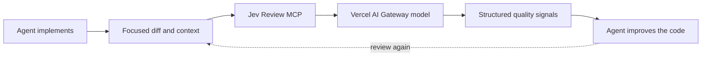

# Jev Review

<div align="center">

**Continuous software-quality review for AI coding agents, powered by [Vercel AI Gateway](https://vercel.com/docs/ai-gateway).**

[](LICENSE)


[Quick start](#quick-start) · [How to use](#how-to-use) · [Client setup](#client-setup) · [Quality dimensions](#quality-dimensions) · [Security](#security-and-privacy)

</div>

Jev Review runs as a local MCP server and gives Claude Code, Codex, Cursor, and OpenCode structured feedback while they work. Your coding agent remains responsible for changing the code; Jev acts as a fast senior-engineering reviewer across correctness, complexity, changeability, modularity, tests, security, and other independent quality dimensions.

> [!IMPORTANT]
> **Your API key is sent only to Vercel AI Gateway for authentication.** Jev Review has no hosted backend, database, telemetry service, or author-operated proxy. The only remote request is sent directly to the Vercel AI Gateway.

## Demo

<p align="center">
  

https://github.com/user-attachments/assets/0ff9f873-0652-4826-af3d-6bb4f42c70b1


</p>

## At a glance

| | |
| --- | --- |
| **Purpose** | Continuous, structured software-quality evaluation |
| **Supported clients** | Claude Code, Codex, Cursor, OpenCode |
| **Distribution** | This GitHub repository—no npm publication |
| **Runtime** | Local Node.js process over MCP stdio |
| **Remote access** | Vercel AI Gateway using your API key |
| **MCP tools** | One focused tool: `jev_review` |
| **Code changes** | Always performed by the primary coding agent |

## Quick start

Requirements:

- Node.js 20 or newer
- A [Vercel AI Gateway API key](https://vercel.com/docs/ai-gateway/authentication-and-byok/api-keys)
- Claude Code, Codex, Cursor, or OpenCode

Set your API key before starting the coding agent:

```bash
export VERCEL_AI_GATEWAY="your-key"
```

The default model is `anthropic/claude-sonnet-4.6`. To choose another Gateway model that supports structured outputs:

```bash
export AI_GATEWAY_MODEL="anthropic/claude-sonnet-4.6"
```

`VERCEL_AI_GATEWAY` is the key variable used by this project. It must be exported so the MCP process inherits it; a shell-only assignment is insufficient. Restart your coding client after changing its environment. The server does not read `.zshrc` itself. A normal Vercel account token is not an AI Gateway key.

Install Jev Review directly from GitHub—no npm publication is required:

```bash
npx plugins add NiazMorshed2007/jev-review
```

Choose your coding client when prompted, restart it, and ask the agent to use `jev-review` while implementing a nontrivial change.

## How to use

### For humans

1. Export `VERCEL_AI_GATEWAY` in your shell (for zsh, put `export VERCEL_AI_GATEWAY="your-key"` in `~/.zshrc`). Never commit the key. Open a new terminal or run `source ~/.zshrc`, then launch your coding client from that terminal.
2. For this checkout, run `npm install` and `npm run validate`, then register its absolute `dist/server.js` path using the manual configuration in [Client setup](#client-setup). The upstream GitHub installer below installs the upstream repository, not your local migration.
3. Confirm the `jev_review` MCP tool is available. Ask your agent:

   > Use jev-review to review my current diff against the task requirements. Inspect the highest-priority findings, fix only justified issues, run tests, then review the changed code again with the previous evaluation.

4. Read the per-dimension scores and priorities alongside test results. Scores are review evidence, not a release gate or an overall quality percentage. Each review uses Gateway credits.
5. After a material fix, ask for another focused review. Keep the same model when comparing results; start a fresh baseline after switching models.

You do not need to paste an API key into chat or manually construct tool arguments. The agent supplies the relevant diff and context. GUI apps may need the environment setup shown under [Cursor](#cursor).

### For LLMs and coding agents

Load [the bundled jev-review skill](skills/jev-review/SKILL.md). Discover the MCP tool named `jev_review` (some clients prefix it with the server name), then call it with focused current context:

```json
{
  "task": "Implement addition of two numbers",
  "diff": "+ export function add(a: number, b: number) { return a + b; }",
  "repositoryContext": "TypeScript utility. No I/O. Addition tests pass."
}
```

Only report validation results you actually observed. The example above is illustrative. At least one of `task`, `diff`, `files`, or `repositoryContext` must contain current context. Omit `previousEvaluation` on the first call. After material changes, pass the complete prior `structuredContent` object as `previousEvaluation`, together with the updated diff; do not pass `{}`, a summary, or the MCP response envelope.

Inspect `metrics`, `priorities`, and, on follow-up calls, `comparison`, `improvements`, and `regressions`. Ignore dimensions with `applicable: false`. Verify suggested weaknesses against the code before editing. Do not repeat identical calls or send secrets, `.env` files, generated bundles, or the entire repository. The tool performs no edits and does not replace local validation.

### Troubleshooting

| Symptom | Action |
| --- | --- |
| `VERCEL_AI_GATEWAY is not set` | Export the variable and restart the client from that shell; check GUI environment inheritance. Never print the key to debug it. |
| HTTP 401 / 403 | Check that the value is an active AI Gateway key and the MCP client inherited it. |
| HTTP 402 | Check Vercel AI Gateway credits and billing. |
| HTTP 429 / 5xx | Transient failures are retried twice; retry later if they persist. |
| Invalid structured review | Retry once or select a model supporting JSON-schema structured outputs. Truncated, refused, or malformed responses are rejected. |
| Context limit / timeout | Send a smaller coherent diff with only the necessary surrounding code. Requests have a 120-second timeout per attempt. |

## How it works



Jev Review is intended for frequent, focused checkpoints: after a coherent implementation slice, after addressing review feedback, and before final handoff. It does not modify files, blindly optimize scores, or replace the project's normal tests and checks.

The configured model returns schema-constrained applicability, score, and weakness decisions through Vercel AI Gateway. Confidence values are model estimates, not calibrated probabilities; old and new model scores are not directly comparable. Jev Review validates and converts those decisions into concise metric scores, confidence levels, prioritized weaknesses, and comparisons with a previous evaluation.

There is deliberately no synthetic “82/100” overall score. Dimension changes such as `Readability 6.3 → 8.1` and `Security 8.2 → 8.2` are more useful than a blended percentage.

## Client setup

| Client | Plugin installation | Manual MCP available |
| --- | --- | --- |
| Claude Code | `npx plugins add NiazMorshed2007/jev-review --target claude-code` | Yes |
| Codex | `npx plugins add NiazMorshed2007/jev-review --target codex` | Yes |
| Cursor | `npx plugins add NiazMorshed2007/jev-review --target cursor` | Yes |
| OpenCode | Manual configuration below | Yes |

Every client starts the same bundled `dist/server.js` process locally over stdio.

### Claude Code

```bash
npx plugins add NiazMorshed2007/jev-review --target claude-code
```

Restart Claude Code and run `/mcp` to confirm that `jev-review` is connected.

To load a local clone while developing:

```bash
claude --plugin-dir /absolute/path/to/jev-review
```

Manual MCP-only setup:

```bash
claude mcp add --scope user jev-review -- node /absolute/path/to/jev-review/dist/server.js
```

### Codex

```bash
npx plugins add NiazMorshed2007/jev-review --target codex
```

Restart Codex and run `/mcp` to verify the connection.

Manual setup in `~/.codex/config.toml`:

```toml
[mcp_servers.jev-review]
command = "node"
args = ["/absolute/path/to/jev-review/dist/server.js"]
env_vars = ["VERCEL_AI_GATEWAY", "AI_GATEWAY_MODEL"]
```

### Cursor

```bash
npx plugins add NiazMorshed2007/jev-review --target cursor
```

Restart Cursor and check **Settings → MCP**. The bundled skill is named `jev-review`; invoke it with `/jev-review` or leave it on **Agent Decides**.

Manual setup in `~/.cursor/mcp.json`:

```json
{
  "mcpServers": {
    "jev-review": {
      "type": "stdio",
      "command": "node",
      "args": ["/absolute/path/to/jev-review/dist/server.js"],
      "env": {
        "VERCEL_AI_GATEWAY": "${env:VERCEL_AI_GATEWAY}"
      }
    }
  }
}
```

If Cursor is launched from the macOS Dock, it may not inherit variables from your shell profile. Make the already-exported key available to GUI applications before starting Cursor:

```bash
launchctl setenv VERCEL_AI_GATEWAY "$VERCEL_AI_GATEWAY"
```

Verify without printing the key:

```bash
test -n "$(launchctl getenv VERCEL_AI_GATEWAY)" && echo "VERCEL_AI_GATEWAY is configured"
```

### OpenCode

OpenCode does not currently appear in the portable `plugins` installer targets. Point it at the same bundled server instead:

```bash
git clone https://github.com/NiazMorshed2007/jev-review.git
cd jev-review
opencode mcp add jev-review --global -- node "$PWD/dist/server.js"
```

For the full skill and MCP setup, add this to `~/.config/opencode/opencode.json`, replacing the absolute path:

```json
{
  "$schema": "https://opencode.ai/config.json",
  "skills": ["/absolute/path/to/jev-review/skills"],
  "mcp": {
    "servers": {
      "jev-review": {
        "type": "local",
        "command": ["node", "/absolute/path/to/jev-review/dist/server.js"],
        "environment": {
          "VERCEL_AI_GATEWAY": "{env:VERCEL_AI_GATEWAY}"
        }
      }
    }
  }
}
```

Run `opencode mcp list` to verify the connection. OpenCode may display the tool as `jev-review_jev_review`; the underlying MCP tool is still `jev_review`.

## MCP tool

Jev Review intentionally starts with one tool: `jev_review`.

```ts
{
  task?: string;
  diff?: string;
  files?: Array<{
    path: string;
    content: string;
  }>;
  repositoryContext?: string;
  previousEvaluation?: Evaluation;
}
```

At least one current-context field is required. Callers should normally send the task and focused diff, adding complete files only when the surrounding implementation is necessary to understand the change. Jev Review never reads the repository automatically.

Jev Review does not impose an additional character, token, or file-count limit. Context limits depend on the selected Gateway model. If the provider rejects an oversized request, reduce unrelated context or split the change into coherent review slices.

The response contains:

- An independent 1–10 score and 0–1 confidence for each applicable metric
- `{ "applicable": false }` for dimensions unsupported by the supplied context
- Prioritized weaknesses and concise improvement suggestions
- Per-metric deltas, improvements, regressions, and unresolved weaknesses when `previousEvaluation` is supplied

## Quality dimensions

Always evaluated when the supplied context is sufficient:

- Correctness and requirement fit
- Cognitive complexity
- Readability and intent
- Modularity and cohesion
- Coupling and dependency quality
- Changeability and change amplification
- Abstraction and API design
- Project and file structure
- Duplication and reuse
- Maintainability
- Testability and test quality
- Reliability and error handling
- Security
- Consistency and conventions
- Documentation and explainability

Evaluated only when relevant evidence is present:

- Performance and resource efficiency
- Scalability and flexibility
- Compatibility and API stability
- Observability and operability

The evaluator judges consequences in context. It does not assume short functions, small files, zero duplication, more layers, more comments, or more tests are automatically better.

## Evaluation workflow

The included `jev-review` skill teaches agents to:

1. Understand the task and inspect the repository.
2. Implement a coherent change and run relevant checks.
3. Call `jev_review` with focused context.
4. Inspect weak metrics, confidence, priorities, and regressions.
5. Apply only feedback justified by the code and requirements.
6. Validate and optionally review again after material changes.
7. Stop when additional changes would provide little real value.

Correctness and the user's requirements always outrank score improvement. A higher score never justifies speculative architecture, unnecessary abstraction, scope expansion, breaking behavior, meaningless tests, or needless rewrites.

## Architecture

```text
jev-review/
├── plugin.json                  # Portable Agent Plugin manifest
├── mcp.json                     # Portable stdio MCP definition
├── .claude-plugin/
│   └── plugin.json              # Claude Code adapter
├── .codex-plugin/
│   └── plugin.json              # Codex metadata
├── skills/
│   └── jev-review/
│       └── SKILL.md             # Agent review workflow
├── src/
│   ├── config/                  # Environment handling
│   ├── evaluation/              # Metrics, scoring, and comparisons
│   ├── jev/                     # Gateway client and validation
│   └── mcp/                     # MCP tool boundary
├── dist/
│   └── server.js                # Committed standalone server bundle
├── public/
│   └── jev-review-demo.mp4      # Product demonstration
└── test/                        # Unit and MCP protocol tests
```

`plugin.json` and `mcp.json` are the portable [Agent Plugins 1.0](https://agent-plugins.org/specification) package. `.claude-plugin/plugin.json` and `.mcp.json` provide Claude Code compatibility, while `.codex-plugin/plugin.json` supplies Codex metadata. These are small packaging adapters around one MCP implementation.

## Development

```bash
git clone https://github.com/NiazMorshed2007/jev-review.git
cd jev-review
npm install
npm run validate
```

Useful commands:

```bash
npm run check
npm test
npm run build
npx plugins discover .
claude plugin validate . --strict
```

`npm run build` creates the committed `dist/server.js` bundle. Unit and MCP protocol tests use local fakes and do not consume Gateway credits; a live review requires `VERCEL_AI_GATEWAY`.

## Security and privacy

The local MCP process reads `VERCEL_AI_GATEWAY` and uses it only in the TLS Authorization header sent directly to `https://ai-gateway.vercel.sh/v1/chat/completions`. Jev Review never stores or logs the key.

Only the `task`, `diff`, `files`, and `repositoryContext` explicitly supplied to `jev_review` are sent through Vercel AI Gateway to the selected model provider. `previousEvaluation` is compared locally and is not included in the current code context. No repository files are discovered or uploaded automatically.

Review context leaves your machine for Vercel AI Gateway and its model providers. Do not supply secrets or unrelated proprietary content; review [Vercel's privacy policy](https://vercel.com/legal/privacy-policy) and your selected provider's data-handling terms. Jev Review complements rather than replaces dedicated security tooling.

## License

[MIT](LICENSE)
